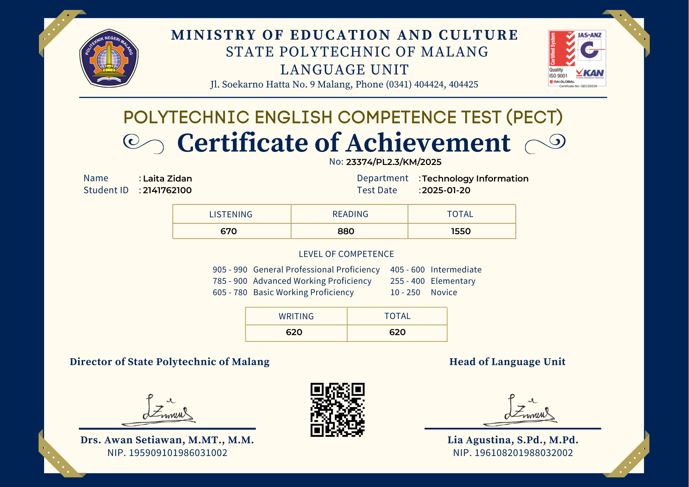
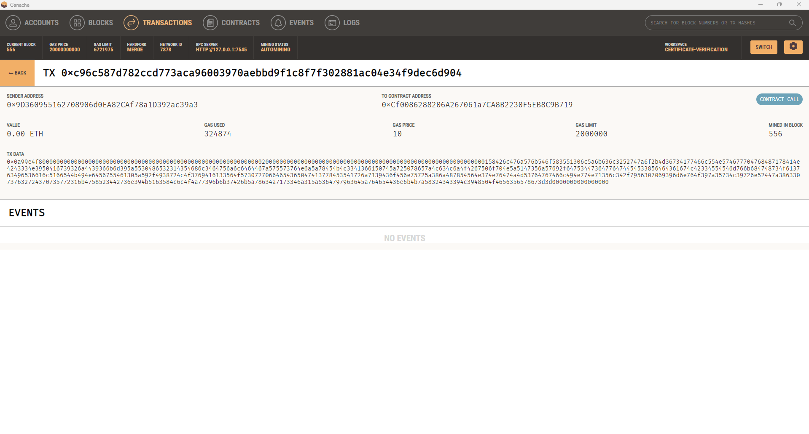
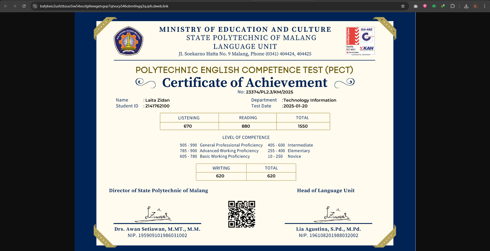
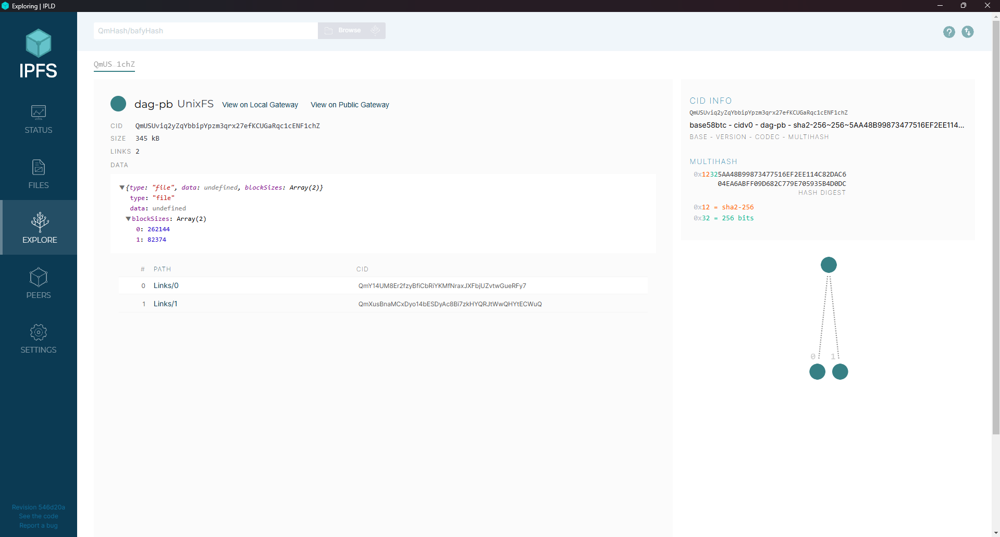

<p align="center">
  
</p>

<h1 align="center">Sistem Verifikasi Sertifikat Digital Berbasis Blockchain</h1>

<p align="center">
  Dibangun oleh Laita Zidan sebagai bagian dari tugas akhir di Politeknik Negeri Malang (POLINEMA).<br>
  Sistem ini mengintegrasikan teknologi blockchain, IPFS, QR Code, Digital Signature RSA, Enkripsi AES untuk memastikan keaslian sertifikat digital.
</p>

---

## 🎯 Tujuan Sistem

- Menghasilkan sertifikat digital yang dapat diverifikasi secara publik
- Memastikan keaslian data melalui digital signature RSA
- Menyediakan QR Code yang mengarah langsung ke sistem verifikasi
- Menjamin kerahasiaan data melalui enkripsi AES
- Menyimpan hasil verifikasi ke IPFS untuk integritas jangka panjang
- Mendukung verifikasi berbasis OCR tanpa login

---

## 🧠 Teknologi yang Digunakan

| Komponen      | Fungsi                                                                 |
|---------------|------------------------------------------------------------------------|
| **Flask**     | Backend: API untuk generate, verifikasi, dan enkripsi data             |
| **MongoDB**   | Penyimpanan metadata terenkripsi dan log audit                         |
| **IPFS**      | Menyimpan sertifikat final secara immutable dan terdesentralisasi      |
| **Blockchain**| Menyimpan digital signature (RSA) dan ID sertifikat                    |
| **React.js**  | Antarmuka frontend untuk admin dan publik                              |
| **AES**       | Enkripsi seluruh data peserta                                          |
| **RSA**       | Tanda tangan digital untuk menjamin integritas sertifikat              |
| **QR Code**   | Tautan publik untuk validasi sertifikat                                |
| **OCR**       | Mengekstrak data dari gambar sertifikat untuk verifikasi otomatis      |

---

## 🧩 Struktur Direktori

```
BLOCKCHAIN-VERIFIKASI-SERTIFIKAT/
├── backend/           # Flask API + enkripsi + Hashing + digital signature + interaksi blockchain + upload IPFS
├── blockchain/        # Smart contract + konfigurasi Truffle
├── frontend/          # React UI (generate, verifikasi, audit)
├── LICENSE            # Lisensi MIT
└── README.md          # Dokumentasi sistem
```

---

## 🔐 Alur Sistem

1. **Admin Login** dan mengisi data sertifikat → dienkripsi AES → simpan MongoDB
2. Buat hash MD5 → ditandatangani RSA → simpan di blockchain
3. Generate Sertifikat
4. QR Code dibuat dan disisipkan ke sertifikat PNG
5. Sertifikat disimpan ke IPFS hanya jika diverifikasi valid
6. **Verifikasi bisa dilakukan melalui frontend** dengan upload gambar sertifikat
7. Sistem akan:
   - Ekstrak data (OCR)
   - Hitung hash ulang
   - Verifikasi RSA Signature
   - Re-generate sertifikat terverifikasi
   - Simpan ke IPFS dan MongoDB
8. Publik dapat memverifikasi hanya dengan memindai QR (tanpa login)

---

## 📋 Contoh Output

```text
✅ Sertifikat Valid
- Certificate ID: CERT-001
- Nama: Laita Zidan
- NIM: 2141762100
- Departemen: Teknologi Informasi
- Tanggal Ujian: 2025-03-22
- Signature RSA: Diverifikasi
- QR Code: Arahkan ke https://verify.domain.com/verify/CERT-001
- Link IPFS: https://ipfs.io/ipfs/<CID>
```

---

## 🖼️ Screenshot

🔗 Sertifikat Terverifikasi
<p align="center">
  
</p>

🔗 Ganache Transaction
<p align="center">  </p>

🔗 IPFS Upload Result
<p align="center">  </p>
<p align="center">  </p>

## 👮 Role & Akses

| Role    | Fitur                                      | 
|---------|--------------------------------------------|
| Admin   | Login, Generate, Verifikasi, Audit Log     |
| Publik  | Verifikasi tanpa login dengan Scan QRCode  |

---

## 📜 Lisensi

&copy; 2025 Laita Zidan — Politeknik Negeri Malang (POLINEMA)  
Dirilis dengan [Lisensi MIT](LICENSE)

---

## 🙋 Tentang Pengembang

**Laita Zidan**  
Program Studi Sistem Informasi Bisnis  
Politeknik Negeri Malang (POLINEMA)  
GitHub: [github.com/elzidanecodes](https://github.com/elzidanecodes)